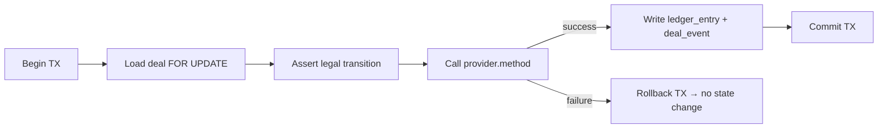

# KAN-40 Spike: Escrow Ledger Design + PaymentProvider Contract

**Author:** Dev B  
**Date:** 2026-07-30  
**Status:** Decision Record  
**Drives:** KAN-41 (`PaymentProvider` interface), KAN-42 (escrow ledger service)

---

## 1. Objective

Design the escrow-ledger service and the `PaymentProvider` abstraction that sits
between the marketplace and an external PSP. The output is this written decision
so KAN-41 and KAN-42 share a single source of truth.

---

## 2. Data Model — Confirmed

The existing `ledger_entry` table in `db/schema.ts` has the required columns;
however, KAN-42 likely needs a partial unique index to prevent double-funding and an optional `'hold_pending'` `entry_type` if we adopt the pending-row approach.

| Field           | Role                                                                    |
| --------------- | ----------------------------------------------------------------------- |
| `campaign_id`   | Groups entries — campaign is the escrow container                       |
| `deal_id`       | Nullable; links `hold`/`release_payout`/`commission` to a specific deal |
| `entry_type`    | `hold`, `release_payout`, `commission`, `refund`                        |
| `amount`        | Signed integer (positive = into escrow, negative = out)                 |
| `balance_after` | Campaign running balance after this entry                               |
| `provider_ref`  | External PSP transaction ID (nullable)                                  |

**Decision:** No table _column_ changes needed. Ledger rows are append-only for financial amounts; if using `hold_pending`, allow a one-time in-transaction finalization update (e.g. set `provider_ref`, `hold_pending` → `hold`).

---

## 3. Commission Math

### 3.1 Rate source

`deal.commission_rate` is a `numeric(5,2)` snapshot taken at offer-accept time,
stored as a percentage (e.g. `15.00` = 15%). Re-pricing the platform rate never
retroactively changes accepted deals.

### 3.2 Open question Q1

The exact commission % is still unconfirmed. **Recommend default: 15%** (industry
standard for creator marketplaces). The execution plan flags Q1 as needing
business sign-off before KAN-20 (seed data). Until then KAN-42 should accept the
rate as a parameter — do not hardcode it.

### 3.3 Payout formula (corrected)

```
                   total_price  (deal.total_price)
                 = video_count × deal.unit_price

     const rateBp = Math.round(commission_rate * 100);       // 15.00% → 1500 bp
     const commission = Math.round((total_price * rateBp) / 10_000);
     const payout = total_price - commission;                 // exact, always

// All values in ETB santim. payout + commission === total_price guaranteed.
```

**Derivation:** `payout` is computed by _subtraction_, not by independent
multiplication. Computing both sides independently produces rounding errors
(~1 in 10 deals at 10% rate). Using integer basis points avoids floating-point
drift from `numeric(5,2)` going through IEEE 754 on the way in.

### 3.4 Ledger entries on approval

When a deliverable is approved (KAN-45), the ledger service writes **two entries**
inside one DB transaction:

1. `release_payout` — negative amount (creates creator receivable), `deal_id` set
2. `commission` — negative amount (platform revenue), `deal_id` set

Their magnitudes sum to `total_price`, so escrow drops by exactly `total_price`.

### 3.5 Refund math

On refund (dispute resolution or decline after funding), the full held amount for
that deal leaves escrow and returns to the brand's available budget:

```
      refund_amount = -deal.total_price  // NEGATIVE entry, type 'refund'
```

One ledger entry: `refund` — **negative** amount. The deal's escrowed funds fall
to zero.

**Why negative.** §2 fixes the convention: positive is _into_ escrow, negative is
_out_. A refund takes money out. Making it positive double-counts — `hold(+X)`
followed by `refund(+X)` sums to `+2X`, so a refunded deal's money becomes
payable a second time. That breaks invariant 6 (zero-sum) and, because the error
inflates rather than depletes the balance, the invariant-7 non-negativity guard
never trips on it.

The brand's budget rising is the _consequence_ of escrow falling, not a second
ledger entry. See §6 for how the two quantities are derived from one column.

---

## 4. PaymentProvider Interface

This is the contract that KAN-41 implements and KAN-42 calls. It lives in
`lib/payment/types.ts` (KAN-41 creates this file).

```typescript
// lib/payment/types.ts  —  PaymentProvider contract

export interface PaymentProvider {
  /**
   * Reserve funds against a payment method.
   * Called when a campaign is funded (KAN-43).
   *
   * - amount: ETB santim (integer, positive)
   * - idempotencyKey: caller-generated UUID so the PSP can deduplicate
   *
   * Returns a provider reference string on success.
   * Throws PaymentError on failure (KAN-44).
   */
  hold(amount: number, idempotencyKey: string): Promise<ProviderHoldResult>;

  /**
   * Transfer held funds to a specific recipient.
   * Called when a deal is approved (KAN-45).
   *
   * - amount: the exact creator payout (total_price - commission); must be ≤ hold amount
   * - recipient: PSP-level identifier for the payee (creator's payout address)
   * - holdRef: the providerRef from the corresponding hold()
   * - idempotencyKey: caller-generated UUID
   *
   * Throws if hold is not in 'held' state.
   */
  capturePayout(
    amount: number,
    recipient: string,
    holdRef: string,
    idempotencyKey: string
  ): Promise<ProviderCaptureResult>;

  /**
   * Release a hold without transferring funds (i.e. cancellation).
   * Called on deal decline after funding, or dispute refund.
   *
   * - holdRef: the providerRef from the corresponding hold()
   * - idempotencyKey: caller-generated UUID
   *
   * Throws if hold is not in 'held' state.
   */
  releaseHold(
    holdRef: string,
    idempotencyKey: string
  ): Promise<ProviderReleaseResult>;

  /**
   * Check the status of a previous operation by provider reference.
   * Used for reconciliation and manual review.
   */
  getStatus(providerRef: string): Promise<ProviderStatus>;
}

// -- Result types ------------------------------------------------------------

export interface ProviderHoldResult {
  providerRef: string;
  status: 'held';
  heldAt: string; // ISO 8601
}

export interface ProviderCaptureResult {
  providerRef: string;
  status: 'captured';
  capturedAt: string;
}

export interface ProviderReleaseResult {
  providerRef: string;
  status: 'released';
  releasedAt: string;
}

export interface ProviderStatus {
  providerRef: string;
  state: 'held' | 'captured' | 'released' | 'failed';
  amount: number;
  updatedAt: string;
  errorMessage?: string;
}

export class PaymentError extends Error {
  constructor(
    message: string,
    public readonly code: PaymentErrorCode
  ) {
    super(message);
    this.name = 'PaymentError';
  }
}

export type PaymentErrorCode =
  | 'INSUFFICIENT_FUNDS'
  | 'PROVIDER_UNAVAILABLE'
  | 'INVALID_REFERENCE'
  | 'DUPLICATE_IDEMPOTENCY'
  | 'UNKNOWN';
```

### 4.1 Why three separate methods, not one `transfer`

The escrow pattern demands a two-phase flow:

1. **hold** — reserves funds at campaign funding time (KAN-43)
2. **capturePayout** / **releaseHold** — days or weeks later after work is done

A single `transfer` call cannot model this delay. The three-method design maps
directly to the deal state machine's funded→completed→payout lifecycle.

### 4.2 Idempotency

Every mutating method accepts an `idempotencyKey` (UUID V4, generated by the
caller). Key space is **method-scoped**: the same key passed to `hold` and to
`capturePayout` addresses two independent records.

A replayed key is handled by comparing the _arguments_, not just the key:

| Replay                            | Behaviour                                                                |
| --------------------------------- | ------------------------------------------------------------------------ |
| Same key, **same** arguments      | Return the original result. Do not re-execute.                           |
| Same key, **different** arguments | Throw `PaymentError` with code `DUPLICATE_IDEMPOTENCY`. Execute nothing. |

The first case is what makes retries safe — §5.3 retries serialization failures
up to three times and every attempt reuses the key, so the ledger service can
retry on timeout without double-charging (KAN-44).

The second case is a caller bug, and returning the cached result for it is the
dangerous failure mode this contract exists to prevent: the caller receives a
`status: 'captured'` receipt describing a _different_ transfer, while the hold it
actually named is untouched. The ledger service would then write
`release_payout` and `commission` rows for money that never moved. Throwing
instead keeps the caller's transaction rolling back (§5.1), which is the only
outcome consistent with invariant 7.

Comparison covers every argument that determines the effect — for
`capturePayout` that is `amount`, `recipient` **and** `holdRef`; a key reused
against a different hold must throw even if the amount matches.

### 4.3 MockPaymentProvider

KAN-41 builds a `MockPaymentProvider` that:

- Stores "holds" in an in-memory `Map<providerRef, { amount, status }>`
- Always succeeds (unless explicitly configured to fail for testing)
- Generates provider refs as `mock_${uuid}`
- Respects idempotency keys, and throws `DUPLICATE_IDEMPOTENCY` when one is
  replayed with different arguments (§4.2)
- Has a `setFailNext(method: string)` toggle for test scenarios

The mock is **not** a test double — it ships to production so the app is
runnable in preview/staging without real PSP credentials.

---

## 5. Escrow Ledger Service Shape

KAN-42 builds a service in `lib/payment/ledger.ts` that:

```typescript
// lib/payment/ledger.ts  —  Escrow ledger service

export class EscrowLedgerService {
  constructor(
    private readonly db: DrizzleClient,
    private readonly provider: PaymentProvider,
  )

  /**
   * Hold funds for all accepted deals in a confirmed campaign.
   * Called by KAN-43 (brand funds campaign).
   *
   * - Sums total_price of every accepted deal
   * - Calls provider.hold() once for the campaign total
   * - Writes one ledger_entry per deal with type 'hold'
   */
  async holdForCampaign(campaignId: string): Promise<void>

  /**
   * Release payout + commission for one approved deliverable.
   * Called by KAN-45 (approve deliverable).
   *
   * - Calls provider.capturePayout() for the creator net amount
   * - Writes two ledger entries: 'release_payout', 'commission'
   * - Updates deal status to 'completed'
   */
  async payoutForDeal(dealId: string): Promise<void>

  /**
   * Refund a deal's held funds back to the campaign.
   * Called by KAN-37 (decline), KAN-38 (expiry), KAN-51 (dispute refund).
   *
   * - Calls provider.releaseHold()
   * - Writes one ledger entry with type 'refund'
   */
  async refundDeal(dealId: string): Promise<void>
}
```

### 5.1 Decision: provider call sits _inside_ the DB transaction



**Rationale:** Placing the call inside the transaction means a provider failure
automatically rolls back every DB change — deal status, ledger entries, and
`deal_event` all return to their prior state. The cost is that the transaction
holds its `FOR UPDATE` row lock while the external call is in flight. For the
MVP's demo scale (single-user testing, sub-second provider mock) this is
acceptable.

### 5.2 Compensation path for the dangerous window

The risk is the opposite direction: the provider _succeeds_ but the DB
_rolls back_ (network error on commit, Postgres crash, etc.). Funds would sit
held at the PSP with no ledger row recording them.

**Decision:** A `hold_pending` row only mitigates the provider-succeeds/DB-rollback window if it is persisted _before_ the provider call in a separate committed step (or via an outbox).
If the provider call stays inside the same DB transaction, a rollback removes the pending row too, so reconciliation must rely on provider-side reporting + idempotency keys.
Adopting this pattern also requires adding `'hold_pending'` to `LedgerEntryType` in `db/schema.ts`.
query `getStatus()` for any PSP ref not linked to a confirmed `hold` entry.

**MVP note:** The `hold_pending` pattern is recommended but can be deferred to
Phase 2 if the team accepts the risk window. The mock provider's synthetic refs
have no real-world cost, so the window only matters when a real PSP is connected.

### 5.3 Locking strategy

Each money-mutating method:

1. Begins a Drizzle `serializable` transaction.
2. Executes `SELECT … FOR UPDATE` on the **campaign row** (prevents concurrent
   funding/approval from reading stale `balance_after`).
3. Also locks the **deal row** with `FOR UPDATE` to guard the state-machine
   transition (prevents double-approval).
4. Calls the provider.
5. If Postgres raises `40001` (serialization failure), retries up to **3 times**
   with exponential backoff (50 ms, 100 ms, 200 ms). If all retries fail, returns
   `PAYMENT_FAILED` and does not change any state.

### 5.4 `balance_after` derivation

`balance_after` is **re-summed** from all prior `ledger_entry` rows for the
campaign inside the same transaction under `FOR UPDATE` — it is **not** carried
forward from the previous row. This guarantees non-negativity under concurrency:
even if two approvals arrive simultaneously, each sees the correct running
balance because the campaign row lock serialises them.

```
balance_after = COALESCE(
  (SELECT SUM(amount) FROM ledger_entry WHERE campaign_id = $1 FOR UPDATE),
  0
) + NEW.amount
```

---

## 6. Key Invariants

| #   | Invariant                                                              | Enforced by                                                                      |
| --- | ---------------------------------------------------------------------- | -------------------------------------------------------------------------------- |
| 1   | Campaign balance = sum of all `amount` in its `ledger_entry` rows      | `balance_after` re-summed under `FOR UPDATE` (§5.4)                              |
| 2   | Every `release_payout` is paired with a prior `hold` for the same deal | Deal state machine (funded → completed)                                          |
| 3   | Total of `release_payout` + `commission` = `total_price` (that deal)   | In-transaction assertion via subtraction formula (§3.3)                          |
| 4   | One `hold` entry per deal per campaign — no double-funding             | Application-level check: `SELECT COUNT(*)` before insert; no dedicated index yet |
| 5   | `provider_ref` on `hold` entries matches a real PSP hold               | Not nullable after funding — written in same transaction                         |
| 6   | Money is never created or destroyed — ledger sum is zero-sum           | Audit: sum all entries across time = 0                                           |
| 7   | Failed provider calls leave campaign untouched                         | KAN-44: roll back DB changes on `PaymentError`                                   |

**Invariant 4 — note on schema change:** §2 and §8 previously stated "no schema
change needed". Invariant 4 requires a partial unique index to prevent
double-funding. This is a **schema addition** (not a change to the table
definition), which is why the table itself needs no migration — the index is
created by a separate migration step. KAN-42 should ship this index. If it
doesn't, the application-level guard (COUNT check) remains the fallback.

**`balance_after` — one quantity, two derivations:** `balance_after` tracks
**funds held in escrow**. `hold` is positive (money in); `release_payout`,
`commission` and `refund` are all negative (money out — to the creator, to the
platform, and back to the brand respectively). A fully settled deal therefore
sums to zero, which is exactly what invariant 6 asserts.

**Available budget is a different quantity and is not stored.** `campaign.budget`
(B) is conserved as three parts:

```
  B         = available + escrowed + spent

  escrowed  = SUM(amount)   over all of the campaign's ledger rows
  spent     = SUM(-amount)  over its 'release_payout' and 'commission' rows
  available = B - escrowed - spent
```

A refund moves value from `escrowed` back to `available`; a payout moves it from
`escrowed` to `spent`. Both are single entries — neither needs a second row, and
no budget column is ever written. This is what satisfies AC-018 ("declined and
expired deals release the reserved cost back to the brand's budget").

---

## 7. Edge Cases

### 7.1 Funding failure (KAN-44)

If `provider.hold()` throws `PaymentError`:

- The DB transaction is rolled back — no entries written
- Campaign status stays `confirmed` (not `funded`)
- Brand sees error and can retry
- Idempotency key prevents double-hold if the PSP received it but response was lost

### 7.2 Partial campaign funding

Not in MVP scope. KAN-42 funds the full campaign or nothing (all-or-nothing per
campaign). Partial funding is a future enhancement.

### 7.3 Multi-deal approval order

Deals are paid out independently as each deliverable is approved. The campaign
balance decreases monotonically. If the brand disputes a deal after some have
already been paid out, only the remaining held balance is available for refund.

### 7.4 Commission on refund

No commission is earned on refunded deals. The platform only takes commission on
`release_payout` entries. Refunds return the full `total_price` to the campaign.

### 7.5 Provider goes down

The `PaymentProvider` interface throws `PaymentError` with code
`PROVIDER_UNAVAILABLE`. The caller (KAN-43/KAN-45) returns HTTP 502 and does not
change any state. A retry mechanism is out of scope for MVP (manual retry by the
user is sufficient).

---

## 8. Summary of Decisions

| Decision                     | Choice                                                                         | Rationale                                                                    |
| ---------------------------- | ------------------------------------------------------------------------------ | ---------------------------------------------------------------------------- |
| Schema change needed?        | **Index only** — partial unique index on `(deal_id) WHERE 'hold'`              | Prevents double-funding; table definition unchanged                          |
| Provider-call ordering       | **Inside** the DB transaction, before commit                                   | Provider failure ⇒ automatic rollback (§5.1)                                 |
| Compensation path            | `hold_pending` row written before provider call; reconciled offline            | Covers provider-succeeds/DB-rollback window (§5.2)                           |
| Locking strategy             | `FOR UPDATE` on campaign row + deal row; serializable isolation                | Prevents concurrent approval from overdrawing (§5.3)                         |
| Serialization-failure retry  | 3 attempts with exponential backoff (50/100/200 ms)                            | Transient conflict does not fail the user (§5.3)                             |
| `balance_after` derivation   | Re-summed from prior entries under lock, not carried forward                   | Guarantees non-negativity under concurrency (§5.4)                           |
| Commission rounding          | `payout = total_price - commission` (subtraction) with integer bp              | Guarantees `payout + commission === total_price` (§3.3)                      |
| Commission rate              | **15% default**, configurable per-deal via snapshot                            | Q1 still open; parameterise in KAN-42                                        |
| Provider methods             | `hold()`, `capturePayout(amount, recipient, holdRef)`, `releaseHold()`         | Two-phase escrow requires funding/approval separation                        |
| `recipient` parameter        | **Added** to `capturePayout` (review correction from KAN-41)                   | Without it a real PSP cannot route funds to a creator                        |
| Method naming deviation      | Spike used `capturePayout`/`releaseHold`; KAN-41 AC used `transfer`/`refund`   | Renames accepted; `capturePayout` preferred for semantic clarity             |
| Idempotency                  | UUID key per method; key space is **method-scoped** (not global)               | Prevents cross-method key collisions                                         |
| Idempotency key reuse        | Same args → replay cached result; **different args → `DUPLICATE_IDEMPOTENCY`** | Replaying a mismatched request reports a transfer that never happened (§4.2) |
| Refund sign                  | **Negative** `refund` entry, consistent with §2 (`negative = out of escrow`)   | A positive refund double-counts: `hold(+X) + refund(+X) = +2X` (§3.5)        |
| Mock ships to prod           | Yes — `MockPaymentProvider` via `getPaymentProvider()` factory                 | Preview/staging runs without real PSP                                        |
| Funding model                | All-or-nothing per campaign                                                    | MVP scope; partial funding is a future enhancement                           |
| Invariant 4 (double-funding) | Application-level COUNT guard (MVP); index recommended (Phase 2)               | Deferred to keep schema migration light                                      |

---

## 9. Exit Criteria

| #   | Criterion                                                                                                  | Status                                              |
| --- | ---------------------------------------------------------------------------------------------------------- | --------------------------------------------------- |
| 1   | ADR recording transaction ordering, locking strategy, and rounding rule                                    | **Done** (§5.1–§5.4, §3.3)                          |
| 2   | Interface signature written down and aligned with KAN-41 AC                                                | **Done** (§4, §8)                                   |
| 3   | Proof-of-concept test showing simulated provider failure leaves zero ledger rows and unchanged deal status | **Done** (`__tests__/poc-provider-failure.test.ts`) |
| 4   | Ledger service story re-estimated on the board                                                             | * —                                                 |

---

## 10. Files KAN-41 Should Create

```
lib/
  payment/
    types.ts          ← PaymentProvider interface + result types + PaymentError
    mock-provider.ts  ← MockPaymentProvider (always-succeed, with failNext toggle)
    index.ts          ← re-exports
```
